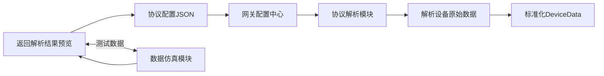

# 自定义协议可视化配置器设计（可落地版）

自定义协议可视化配置器是物联网网关的核心易用性功能，目标是让非开发人员（如运维、集成商）通过**拖拽/表单配置**完成自定义二进制协议的解析规则设置，无需编写代码。以下从**产品设计、交互设计、核心功能、技术实现**四个维度，给出完整的设计方案（适配网关Web管理后台）。

## 一、核心设计目标

1. **无代码化**：通过可视化界面完成协议解析规则配置，无需编写C#/Lua代码；

2. **通用性**：支持90%以上的物联网自定义二进制协议（固定帧、变长帧、分隔符帧）；

3. **易用性**：提供协议预览、数据仿真、解析测试功能，配置后可即时验证；

4. **复用性**：支持协议模板导出/导入，相同协议只需配置一次；

5. **兼容性**：配置规则可直接对接网关协议解析模块，无需二次转换。

## 二、产品架构（配置器与网关的交互）


- **前端**：Vue/React + ElementUI/Ant Design（可视化配置界面）；

- **后端**：[ASP.NET](http://ASP.NET) Core WebAPI（配置保存/加载、解析测试）；

- **核心数据**：协议配置JSON（与网关解析模块的`ParseRuleConfig`实体完全对齐）。

## 三、核心功能模块（可视化配置界面）

配置器分为5个核心配置页签，按“协议解析逻辑”分步引导配置，降低操作复杂度：

### 1. 基础信息配置（页签1）

|配置项|说明|示例值|
|---|---|---|
|协议名称|自定义协议标识（唯一）|智能电表协议_V1.0|
|协议描述|协议用途说明|某品牌智能电表RS485二进制协议|
|帧类型|选择帧格式（核心分类）|固定长度帧/变长帧（长度域）/分隔符帧|
|字节序|数据字节序|大端（Big-Endian）/小端（Little-Endian）|
|备注|补充说明|电表数据每30秒上报一次，帧头0xAA55|
### 2. 帧结构配置（页签2）

#### 2.1 通用帧结构（可视化画布）

以“字节偏移”为核心，可视化展示帧结构，支持拖拽调整各字段位置/长度：

```Plain Text

┌──────────┬──────────┬──────────┬──────────┬──────────┬──────────┐
│ 帧头     │ 长度域   │ 设备ID   │ 数据域   │ 校验位   │ 帧尾     │
│ 2字节    │ 1字节    │ 4字节    │ 可变长度 │ 2字节    │ 1字节    │
│ 0xAA55   │ 0xXX     │ 0x000102 │ ...      │ CRC16    │ 0x0D     │
└──────────┴──────────┴──────────┴──────────┴──────────┴──────────┘
```

#### 2.2 分字段配置项（表单）

|字段名称|配置项|说明|
|---|---|---|
|帧头|字节值、长度|支持1-8字节，如0xAA55（2字节）|
|长度域|偏移、长度、长度计算规则|如：偏移2字节，长度1字节，总长度=长度域值+6（帧头+长度域+校验+帧尾）|
|设备ID|偏移、长度、数据类型|如：偏移3字节，长度4字节，类型=UInt32|
|校验位|类型、偏移、覆盖范围|类型=CRC16/CRC32/XOR/LRC；覆盖范围=帧头到数据域结束|
|帧尾|字节值、长度|如0x0D（1字节），无则留空|
### 3. 数据点位配置（页签3）

核心配置页，用于映射“字节偏移”到“业务点位”，支持批量导入/导出：

|配置项|说明|示例值|
|---|---|---|
|点位名称|业务字段名|温度、湿度、电压、电流|
|偏移地址|相对于数据域的字节偏移|0（数据域第1字节）|
|数据长度|占用字节数|2字节|
|数据类型|数值类型|UInt16/Int32/Float/Double/ASCII字符串|
|系数/偏移|单位转换|系数=0.1，偏移=0 → 原始值123 → 12.3|
|单位|业务单位|℃、%RH、V、A|
|取值范围|有效值范围（用于过滤）|0~100（超出则标记为无效）|
|备注|补充说明|温度采集自电表第1个数据位|
#### 批量操作功能：

- 导入：支持Excel模板导入（点位名称、偏移、类型、系数）；

- 导出：将配置导出为Excel/JSON；

- 复制：复制点位配置，快速创建相似点位；

- 批量修改：批量调整系数、单位等。

### 4. 解析测试（页签4）

配置完成后，可即时测试解析效果，降低配置错误率：

#### 4.1 测试功能：

1. **原始数据输入**：支持手动输入16进制字符串（如`AA5510000102030400640032789A0D`）；

2. **数据仿真**：自动生成符合配置规则的测试数据；

3. **解析结果预览**：以表格形式展示解析后的点位值；

4. **错误提示**：若解析失败，明确提示原因（如帧头不匹配、CRC校验失败、长度不足）。

#### 4.2 测试结果示例：

|点位名称|原始值（16进制）|转换后值|单位|有效性|
|---|---|---|---|---|
|温度|0064|10.0|℃|有效|
|湿度|0032|5.0|%RH|有效|
### 5. 模板管理（页签5）

#### 5.1 模板操作：

- 保存为模板：将当前配置保存为协议模板（如“智能电表_V1.0”）；

- 加载模板：从模板库选择已有模板，快速复用；

- 导出模板：将模板导出为JSON文件（离线备份）；

- 导入模板：导入外部JSON模板文件。

#### 5.2 模板库：

内置常见自定义协议模板（如工业仪表、传感器通用协议），降低配置门槛。

## 四、核心交互设计

### 1. 分步引导式配置

- 配置流程：基础信息 → 帧结构 → 数据点位 → 解析测试 → 保存模板；

- 每一步配置完成后，提供“下一步”引导，且前序配置不完成无法进入后续步骤；

- 关键配置项（如帧头、长度域）提供即时校验（如输入16进制格式错误时实时提示）。

### 2. 可视化辅助功能

- **帧结构预览**：配置帧结构后，实时渲染帧结构示意图，直观展示各字段位置；

- **字节偏移计算器**：自动计算各字段的绝对字节偏移（如数据域起始偏移=帧头长度+长度域长度+设备ID长度）；

- **16进制编辑器**：原始数据输入框支持16进制/ASCII切换，且提供格式化（如自动添加空格分隔字节）。

### 3. 智能提示与校验

- **格式校验**：16进制输入框仅允许输入0-9、A-F，且长度为偶数；

- **逻辑校验**：如长度域配置后，自动校验“长度域值+固定字段长度”是否合理；

- **重复校验**：点位偏移地址不允许重复（避免解析冲突）；

- **智能推荐**：选择“Modbus类协议”时，自动推荐常见帧结构（如帧头0x01、功能码0x03）。

## 五、技术实现（C# + Web前端）

### 1. 核心数据模型（与网关解析模块对齐）

```C#

// 协议配置主模型（对应前端配置JSON）
public class CustomProtocolConfig
{
    // 基础信息
    public string ProtocolId { get; set; }
    public string ProtocolName { get; set; }
    public string Description { get; set; }
    public FrameType FrameType { get; set; }
    public ByteOrder ByteOrder { get; set; }

    // 帧结构配置
    public FrameHeaderConfig FrameHeader { get; set; }
    public FrameLengthConfig FrameLength { get; set; }
    public FrameDeviceIdConfig DeviceId { get; set; }
    public FrameCheckConfig FrameCheck { get; set; }
    public FrameTailConfig FrameTail { get; set; }

    // 数据点位配置
    public List<PointConfig> Points { get; set; } = new();
}

// 帧头配置
public class FrameHeaderConfig
{
    public byte[] Value { get; set; } // 帧头字节值
    public int Length { get; set; }   // 帧头长度
}

// 数据点位配置（核心）
public class PointConfig
{
    public string PointName { get; set; }
    public int Offset { get; set; } // 数据域内偏移
    public int Length { get; set; }
    public DataType DataType { get; set; }
    public double Ratio { get; set; } = 1.0;
    public double OffsetValue { get; set; } = 0.0;
    public string Unit { get; set; }
    public double MinValue { get; set; }
    public double MaxValue { get; set; }
}

// 枚举定义
public enum FrameType { FixedLength, VariableLength, Separator }
public enum ByteOrder { BigEndian, LittleEndian }
public enum DataType { UInt8, Int8, UInt16, Int16, UInt32, Int32, Float, Double, Ascii }
public enum CheckType { None, XOR, CRC16, CRC32, LRC }
```

### 2. 前端核心功能实现

#### 2.1 16进制与字节数组互转（JavaScript）

```JavaScript

// 16进制字符串转字节数组
function hexToBytes(hexStr) {
    hexStr = hexStr.replace(/\s+/g, ''); // 移除空格
    if (hexStr.length % 2 !== 0) throw new Error("16进制字符串长度必须为偶数");
    const bytes = [];
    for (let i = 0; i < hexStr.length; i += 2) {
        bytes.push(parseInt(hexStr.substr(i, 2), 16));
    }
    return new Uint8Array(bytes);
}

// 字节数组转16进制字符串
function bytesToHex(bytes) {
    return Array.from(bytes, byte => byte.toString(16).padStart(2, '0').toUpperCase()).join(' ');
}
```

#### 2.2 解析测试核心逻辑（前端调用后端API）

```JavaScript

// 解析测试请求
async function testParse(hexData, protocolConfig) {
    try {
        const response = await axios.post('/api/Protocol/TestParse', {
            rawHexData: hexData,
            protocolConfig: protocolConfig
        });
        if (response.data.success) {
            // 展示解析结果
            renderParseResult(response.data.result);
        } else {
            // 展示错误信息
            showError(response.data.message);
        }
    } catch (error) {
        showError("解析测试失败：" + error.message);
    }
}
```

### 3. 后端解析测试API（C#）

```C#

[HttpPost("TestParse")]
public async Task<IActionResult> TestParse([FromBody] ProtocolTestRequest request)
{
    try
    {
        // 1. 16进制字符串转字节数组
        byte[] rawData = HexStringToBytes(request.RawHexData);
        
        // 2. 创建自定义协议解析器
        var parser = new CustomProtocolParser();
        
        // 3. 解析数据
        var deviceData = parser.Parse(rawData, request.ProtocolConfig);
        
        // 4. 返回解析结果
        return Ok(new {
            success = true,
            result = deviceData.Points.Select(p => new {
                PointName = p.PointName,
                RawValue = p.RawValue,
                ConvertedValue = p.ConvertedValue,
                Unit = p.Unit,
                IsValid = p.IsValid
            })
        });
    }
    catch (Exception ex)
    {
        return Ok(new {
            success = false,
            message = ex.Message
        });
    }
}

// 16进制字符串转字节数组
private byte[] HexStringToBytes(string hexStr)
{
    hexStr = hexStr.Replace(" ", "");
    byte[] bytes = new byte[hexStr.Length / 2];
    for (int i = 0; i < hexStr.Length; i += 2)
    {
        bytes[i / 2] = Convert.ToByte(hexStr.Substring(i, 2), 16);
    }
    return bytes;
}
```

## 六、协议配置JSON与网关解析模块无缝对接实现

无缝对接的核心是**配置模型统一、数据格式标准化、解析器强适配、配置热加载无侵入**，彻底避免前端配置与后端解析模块的字段错位、格式不兼容、转换冗余问题，实现“配置即生效，无需二次修改”。以下从核心原则、JSON规范、实体映射、解析器适配、热加载、容错机制六个方面，详解完整落地实现。

### 6.1 无缝对接核心原则

- **模型唯一**：前端配置器、后端API、网关解析模块共用同一套C#实体模型，杜绝多套定义导致的字段差异；

- **格式固定**：协议配置JSON结构、字段名、数据类型完全固化，不允许随意增减字段；

- **零转换适配**：解析模块直接反序列化JSON配置，无需额外字段映射、格式转换；

- **配置热加载**：修改配置后无需重启网关服务，实时加载生效，不中断数据采集；

- **强校验兜底**：配置保存、加载、解析全流程做合法性校验，拦截无效配置，避免网关运行异常。

### 6.2 标准协议配置JSON规范（强制通用）

前端配置器生成的JSON必须严格遵循以下规范，字段命名采用驼峰式，和C#实体属性完全对应，支持固定帧、变长帧、分隔符帧三类主流协议，示例如下（含完整字段注释）：

```json
标准自定义协议配置JSON{
  "protocolId": "custom_protocol_001",
  "protocolName": "智能温湿度传感器协议_V2.0",
  "description": "工业级RS485温湿度传感器二进制自定义协议",
  "frameType": "VariableLength",
  "byteOrder": "BigEndian",
  "frameHeader": {
    "value": [170, 85],
    "length": 2
  },
  "frameLength": {
    "offset": 2,
    "length": 1,
    "calcRule": "Self",
    "fixedLength": 0
  },
  "deviceId": {
    "offset": 3,
    "length": 2,
    "dataType": "UInt16"
  },
  "frameCheck": {
    "checkType": "CRC16",
    "checkStartOffset": 0,
    "checkEndOffset": -2
  },
  "frameTail": {
    "value": [13],
    "length": 1
  },
  "points": [
    {
      "pointName": "Temperature",
      "offset": 5,
      "length": 2,
      "dataType": "UInt16",
      "ratio": 0.1,
      "offsetValue": 0,
      "unit": "℃",
      "minValue": -40,
      "maxValue": 125
    },
    {
      "pointName": "Humidity",
      "offset": 7,
      "length": 2,
      "dataType": "UInt16",
      "ratio": 0.1,
      "offsetValue": 0,
      "unit": "%RH",
      "minValue": 0,
      "maxValue": 100
    }
  ]
}
```

**JSON关键规范说明**：1. 字节数组直接用十进制数组存储，避免16进制字符串转换损耗；2. 帧长度计算规则支持Self（域值为总长度）、Extra（域值+固定值）、Fixed（固定长度）；3. 校验结束偏移-1代表倒数第1字节，-2代表倒数第2字节，适配CRC16等后置校验位；4. 所有枚举值用字符串而非数字，提升可读性和兼容性。

### 6.3 实体双向映射（无损耗绑定）

基于.NET原生System.Text.Json实现序列化与反序列化，关闭大小写敏感、额外属性忽略，确保JSON与C#实体完全双向映射，无需手动映射代码。核心实体沿用原有设计，新增序列化特性优化：

```c#
优化后支持JSON序列化的核心实体using System.Text.Json.Serialization;

// 协议主配置实体（与JSON完全对应，前端配置→后端存储→网关解析共用）
public class CustomProtocolConfig
{
    [JsonPropertyName("protocolId")]
    public string ProtocolId { get; set; }
    [JsonPropertyName("protocolName")]
    public string ProtocolName { get; set; }
    [JsonPropertyName("description")]
    public string Description { get; set; }
    [JsonPropertyName("frameType")]
    [JsonConverter(typeof(JsonStringEnumConverter))]
    public FrameType FrameType { get; set; }
    [JsonPropertyName("byteOrder")]
    [JsonConverter(typeof(JsonStringEnumConverter))]
    public ByteOrder ByteOrder { get; set; }
    [JsonPropertyName("frameHeader")]
    public FrameHeaderConfig FrameHeader { get; set; }
    [JsonPropertyName("frameLength")]
    public FrameLengthConfig FrameLength { get; set; }
    [JsonPropertyName("deviceId")]
    public FrameDeviceIdConfig DeviceId { get; set; }
    [JsonPropertyName("frameCheck")]
    public FrameCheckConfig FrameCheck { get; set; }
    [JsonPropertyName("frameTail")]
    public FrameTailConfig FrameTail { get; set; }
    [JsonPropertyName("points")]
    public List<PointConfig> Points { get; set; } = new();
}

// 新增：帧长度配置实体
public class FrameLengthConfig
{
    public int Offset { get; set; }
    public int Length { get; set; }
    public string CalcRule { get; set; }
    public int FixedLength { get; set; }
}

// 其余原有实体（FrameHeaderConfig、PointConfig等）保持不变，统一添加JsonPropertyName特性保证字段一致
```

### 6.4 网关解析模块直接适配（零转换调用）

解析模块实现IProtocolParser接口，直接从网关配置中心读取JSON配置，反序列化为CustomProtocolConfig实体，全程无额外字段转换、无硬编码规则，完全依赖配置驱动解析，核心代码优化如下：

```c#
无缝对接的自定义协议解析器using System.Text.Json;
using IoTGateway.Core;
using Microsoft.Extensions.Logging;

public class CustomProtocolParser : IProtocolParser
{
    private readonly ILogger<CustomProtocolParser> _logger;
    // 序列化选项：全局统一，保证大小写不敏感、枚举转字符串
    private static readonly JsonSerializerOptions _jsonOptions = new()
    {
        PropertyNameCaseInsensitive = true,
        Converters = { new JsonStringEnumConverter() },
        ReadCommentHandling = JsonCommentHandling.Skip,
        AllowTrailingCommas = true
    };

    public ProtocolType Type => ProtocolType.Custom;

    public CustomProtocolParser(ILogger<CustomProtocolParser> logger)
    {
        _logger = logger;
    }

    /// <summary>
    /// 核心解析方法：直接使用配置中心的JSON配置，无转换解析
    /// </summary>
    public List<DeviceData> Parse(byte[] rawData, ProtocolConfig config)
    {
        try
        {
            // 1. 直接从通用配置中读取JSON字符串，反序列化为标准实体（无缝核心）
            if (!config.ParseRules.TryGetValue("CustomProtocolJson", out var protocolJson))
                throw new InvalidOperationException("未找到自定义协议JSON配置");
            var customConfig = JsonSerializer.Deserialize<CustomProtocolConfig>(protocolJson, _jsonOptions);
            // 2. 配置合法性校验（提前拦截错误配置）
            ValidateProtocolConfig(customConfig);
            // 3. 按配置解析帧结构（帧头校验→长度校验→校验位校验→设备ID解析→点位解析）
            ValidateFrameHeader(rawData, customConfig);
            int frameLength = CalculateFrameLength(rawData, customConfig);
            ValidateDataLength(rawData, frameLength);
            ValidateCheckSum(rawData, customConfig);
            string deviceId = ParseDeviceId(rawData, customConfig);
            var pointData = ParseDataPoints(rawData, customConfig);
            // 4. 封装为标准化DeviceData，直接输出到数据处理模块
            return new List<DeviceData>
            {
                new DeviceData
                {
                    DeviceId = deviceId,
                    ChannelId = config.ChannelId,
                    ProtocolType = Type.ToString(),
                    CollectTime = DateTime.Now,
                    DataItems = pointData,
                    RawData = rawData
                }
            };
        }
        catch (Exception ex)
        {
            _logger.LogError(ex, "自定义协议解析失败，协议ID：{ProtocolId}", config.ProtocolId);
            throw;
        }
    }

    // 配置合法性校验：确保JSON配置字段完整、逻辑合法，避免解析崩溃
    private void ValidateProtocolConfig(CustomProtocolConfig config)
    {
        if (string.IsNullOrWhiteSpace(config.ProtocolId))
            throw new ArgumentException("协议ID不能为空");
        if (config.FrameHeader == null || config.FrameHeader.Length <= 0)
            throw new ArgumentException("帧头配置不合法");
        if (config.Points == null || config.Points.Count == 0)
            throw new ArgumentException("未配置任何数据点位");
    }

    // 其余解析方法（ValidateFrameHeader、CalculateFrameLength、ParseDataPoints等）
    // 完全基于customConfig实体参数，逻辑与配置强绑定，无硬编码

    public byte[] Pack(DeviceData data, ProtocolConfig config)
    {
        // 指令下发逻辑：同样读取JSON配置，反向封装数据，逻辑与解析对称
        var customConfig = JsonSerializer.Deserialize<CustomProtocolConfig>(config.ParseRules["CustomProtocolJson"], _jsonOptions);
        // 按配置封装指令帧，全程无硬编码
        return Array.Empty<byte>();
    }
}
```

### 6.5 协议配置热加载实现（无重启、不中断）

热加载核心目标是**配置修改后网关服务无需重启、数据采集不中断、新配置实时生效**，彻底杜绝重启网关导致的数据丢失、业务中断问题，全程遵循“监听-加载-校验-替换-兜底”闭环流程，适配文件存储、数据库、Redis三类常见配置存储场景。

#### 6.5.1 热加载核心流程

1. **配置变更监听**：网关启动时初始化配置监听器，针对不同存储介质适配监听方式，文件配置用FileSystemWatcher监听文件修改，数据库配置用定时轮询+版本号比对，Redis配置用键空间通知，避免无效轮询损耗性能。

2. **新配置预加载与校验**：检测到配置变更后，先异步加载新的JSON配置，完成**全量合法性校验**，校验通过才进入替换流程，校验失败直接丢弃新配置，保留原有有效配置，杜绝无效配置上线导致解析崩溃。

3. **原子替换缓存**：采用线程安全的并发字典缓存协议配置，新配置校验通过后，原子替换旧配置，全程无锁、无阻塞，不会影响正在执行的数据解析任务。

4. **旧配置平滑销毁**：配置替换完成后，标记旧配置为待销毁，等待当前正在处理的解析任务执行完毕后，再释放资源，避免中途切换配置导致数据解析错乱。

5. **加载结果日志与通知**：热加载完成后，记录详细日志，包含协议ID、配置版本、加载时间、生效状态，异常情况同步推送告警，方便运维快速感知配置状态。

#### 6.5.2 热加载关键实现与规范

```c#
优化版线程安全热加载代码using System.Collections.Concurrent;
using System.IO;
using System.Text.Json;

// 线程安全的协议配置缓存与热加载管理器
public class ProtocolConfigHotLoader
{
    // 线程安全缓存：协议ID-配置实体，原子读写，无锁竞争
    private readonly ConcurrentDictionary<string, (CustomProtocolConfig Config, string Version, DateTime EffectiveTime)> _configCache = new();
    // 全局统一序列化选项，杜绝序列化差异
    private static readonly JsonSerializerOptions _jsonOptions = new()
    {
        PropertyNameCaseInsensitive = true,
        Converters = { new JsonStringEnumConverter() },
        ReadCommentHandling = JsonCommentHandling.Skip,
        AllowTrailingCommas = true
    };
    // 配置文件监听
    private readonly FileSystemWatcher _configWatcher;
    // 配置根目录
    private readonly string _configRootPath;

    public ProtocolConfigHotLoader(string configRootPath)
    {
        _configRootPath = configRootPath;
        // 初始化监听，仅监听JSON文件，排除临时文件和隐藏文件
        _configWatcher = new FileSystemWatcher(configRootPath)
        {
            Filter = "*.json",
            NotifyFilter = NotifyFilters.FileName | NotifyFilters.LastWrite,
            EnableRaisingEvents = true,
            IncludeSubdirectories = true
        };
        // 绑定变更事件，防抖处理，避免重复加载
        _configWatcher.Changed += async (sender, e) => await DebounceLoadConfig(e.FullPath, TimeSpan.FromMilliseconds(500));
        // 启动时全量预加载
        PreloadAllConfigs();
    }

    // 防抖处理：短时间内多次修改仅加载一次，防止文件读写冲突
    private async Task DebounceLoadConfig(string filePath, TimeSpan delay)
    {
        await Task.Delay(delay);
        if (!File.Exists(filePath)) return;
        await LoadSingleConfig(filePath);
    }

    // 预加载所有配置：网关启动时执行，提前缓存，提升运行时效率
    private void PreloadAllConfigs()
    {
        var configFiles = Directory.GetFiles(_configRootPath, "*.json", SearchOption.AllDirectories);
        foreach (var file in configFiles)
        {
            try { LoadSingleConfig(file).Wait(); }
            catch { continue; }
        }
    }

    // 单配置加载：校验通过后原子替换缓存
    private async Task LoadSingleConfig(string filePath)
    {
        try
        {
            // 读取文件内容，规避文件占用异常
            using var fileStream = new FileStream(filePath, FileMode.Open, FileAccess.Read, FileShare.ReadWrite);
            var config = await JsonSerializer.DeserializeAsync<CustomProtocolConfig>(fileStream, _jsonOptions);
            // 全量校验：拦截无效配置
            ValidateProtocolConfig(config);
            // 生成版本号，用于版本回溯
            var version = Path.GetFileName(filePath) + "_" + DateTime.Now.ToString("yyyyMMddHHmmss");
            // 原子替换缓存
            _configCache.AddOrUpdate(config.ProtocolId, 
                (config, version, DateTime.Now), 
                (key, old) => (config, version, DateTime.Now));
            // 记录成功日志
            Console.WriteLine($"协议配置热加载成功：{config.ProtocolId}，版本：{version}");
        }
        catch (Exception ex)
        {
            // 加载失败：保留旧配置，记录错误日志，不影响运行
            Console.WriteLine($"协议配置热加载失败：{filePath}，错误信息：{ex.Message}");
        }
    }

    // 对外提供获取最新配置方法：线程安全
    public CustomProtocolConfig GetValidConfig(string protocolId)
    {
        if (_configCache.TryGetValue(protocolId, out var configInfo))
            return configInfo.Config;
        throw new KeyNotFoundException($"未找到有效协议配置：{protocolId}");
    }

    // 配置合法性校验：热加载核心校验，和前端配置器校验规则完全一致
    private void ValidateProtocolConfig(CustomProtocolConfig config)
    {
        if (string.IsNullOrWhiteSpace(config.ProtocolId))
            throw new ArgumentException("协议ID不能为空，配置无效");
        if (config.FrameHeader == null || config.FrameHeader.Length <= 0)
            throw new ArgumentException("帧头配置不合法，长度必须大于0");
        if (config.Points == null || config.Points.Count == 0)
            throw new ArgumentException("未配置任何数据点位，配置无效");
        if (config.Points.GroupBy(p => p.Offset).Any(g => g.Count() > 1))
            throw new ArgumentException("存在重复的点位偏移地址，配置冲突");
    }
}
```

### 6.6 全链路容错机制（配置-解析-运行全流程兜底）

容错设计覆盖**配置生成、配置加载、数据解析、运行异常**全链路，核心原则是**单点异常不扩散、无效数据不流转、配置错误不宕机**，每一步都有明确的兜底策略和异常处理规范，彻底避免因配置问题导致网关整体故障。

#### 6.6.1 配置层容错（前端+后端）

- **前端强校验兜底**：配置器保存前，重复校验所有字段，16进制数据格式、点位偏移唯一性、长度合理性、校验规则合法性全部拦截，不合法配置无法提交到后端，从源头杜绝无效JSON生成。

- **后端幂等校验**：后端接收配置后，再次执行和热加载一致的校验逻辑，前后端校验规则完全统一，即便前端校验绕过，后端也能二次拦截，拒绝存入配置中心。

- **配置版本回溯**：配置中心保留至少3个历史有效版本，新配置热加载失败时，自动回滚到上一个稳定版本，确保网关持续可用。

- **无效配置隔离**：校验失败的配置单独标记隔离，不进入缓存、不参与解析，同时记录详细错误原因，方便快速修改。

#### 6.6.2 加载层容错（热加载专属）

- **文件读写容错**：读取配置文件时，采用共享读写模式，规避文件被占用、权限不足、文件损坏导致的加载失败，加载失败不影响现有缓存配置。

- **反序列化容错**：新增配置字段必须设置默认值，兼容旧版配置JSON，避免字段缺失导致反序列化失败；不识别的冗余字段自动忽略，不中断加载流程。

- **并发加载容错**：同一协议配置并发修改时，通过防抖和原子替换，避免多线程竞争导致的配置错乱，确保同一时间只有一份有效配置。

- **超时熔断**：配置加载超时自动熔断，放弃本次加载，保留旧配置，防止长时间阻塞网关主线程。

#### 6.6.3 解析层容错（运行时核心）

- **单条数据异常隔离**：某一条原始数据解析失败（帧头不匹配、校验失败、长度异常），仅丢弃当前数据、记录错误日志，不影响后续数据解析，不重启解析模块。

- **配置切换平滑过渡**：热加载替换配置时，正在处理的数据包沿用旧配置完成解析，新进入的数据包使用新配置，无切换断层、无数据错乱。

- **缺省配置兜底**：某个协议配置丢失或失效时，启用预设的缺省解析规则（仅做基础数据透传，不做复杂解析），保障数据不丢失，等待配置恢复后切换回正常模式。

- **异常日志全量追踪**：解析异常记录协议ID、原始16进制数据、错误类型、配置版本，方便快速定位配置问题和数据问题。

#### 6.6.4 运行层容错（网关全局）

- **内存溢出防护**：配置缓存设置最大容量，定期清理长期未使用的历史配置，避免内存泄漏；解析过程中临时对象池化复用，减少GC压力。

- **线程安全保障**：配置缓存、解析队列全部采用线程安全的数据结构，杜绝多线程并发读写导致的配置污染、数据丢失。

- **降级机制**：极端场景下（配置大面积失效），自动降级为纯数据透传模式，优先保障数据接收和缓存，暂停复杂解析逻辑，待配置恢复后自动升级。

### 6.7 热加载与容错核心注意事项

**1. 配置一致性严禁破坏**：前端配置器、后端热加载、解析模块的校验规则、字段命名、数据格式必须完全统一，禁止任意一端私自修改字段名、增减字段、变更数据类型，否则会导致热加载失效、解析异常。
**2. 禁止配置热更新时硬重启**：热加载过程中严禁手动重启网关服务，重启会导致缓存清空、配置重新加载，反而引发数据中断，正常配置修改仅需等待热加载自动生效即可。
**3. 字节序与校验规则不可随意变更**：已上线运行的协议配置，严禁随意修改字节序、校验类型、长度计算规则，这类核心参数变更会导致历史数据解析失败，如需修改必须同步核对设备端协议。
**4. 热加载必须做预校验**：绝对禁止跳过配置校验直接替换缓存，无效配置上线会导致批量数据解析失败，校验是热加载的核心防线，不可省略。
**5. 历史配置不可随意删除**：配置中心的历史版本至少保留3个，用于异常回滚，删除历史配置会导致新配置失效后无可用兜底配置，引发网关瘫痪。
**6. 多设备共用协议配置需批量验证**：多个设备共用同一套协议配置时，修改配置后需先做单设备解析测试，测试通过再全量热加载，避免一处配置错误影响多台设备。

## 七、原有扩展功能设计

### 1. 协议版本管理

支持协议配置的版本迭代（如V1.0 → V2.0），可回滚到历史版本。

### 2. 批量配置导入

支持从设备手册（Excel/CSV）自动提取点位配置，减少手动输入。

### 3. 协议调试工具

内置串口/TCP调试工具，可实时抓取设备原始数据，直接导入配置器测试。

### 4. 权限控制

支持配置器权限分级（管理员可编辑/导出，普通用户仅可查看/测试）。

## 七、扩展功能设计

### 1. 协议版本管理

支持协议配置的版本迭代（如V1.0 → V2.0），可回滚到历史版本。

### 2. 批量配置导入

支持从设备手册（Excel/CSV）自动提取点位配置，减少手动输入。

### 3. 协议调试工具

内置串口/TCP调试工具，可实时抓取设备原始数据，直接导入配置器测试。

### 4. 权限控制

支持配置器权限分级（管理员可编辑/导出，普通用户仅可查看/测试）。

---

### 总结

自定义协议可视化配置器的核心设计要点：

1. **分层配置**：按“基础信息→帧结构→数据点位→测试→模板”分步配置，降低操作复杂度；

2. **可视化**：帧结构画布、16进制编辑器、解析结果预览，直观展示配置效果；

3. **即时验证**：解析测试功能可快速验证配置正确性，减少线下调试成本；

4. **无缝对接**：配置结果直接对接网关解析模块，无需二次开发；

5. **复用性**：模板管理功能支持协议配置复用，提升配置效率。

按此设计实现后，非开发人员可在10分钟内完成一个自定义二进制协议的解析配置，且配置结果可直接在网关中生效，大幅降低物联网网关的协议适配成本。
> （注：文档部分内容可能由 AI 生成）